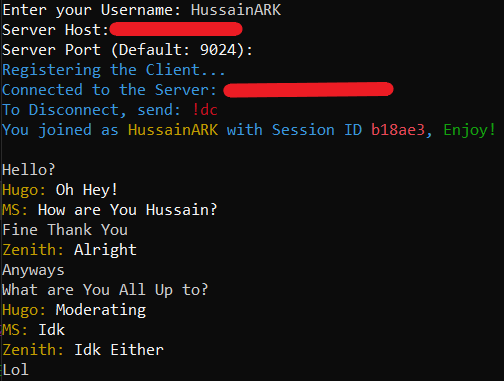

# Echticka

A Basic CLI-Based Communications App made using Pure Python 3.7

## Some Info

This Program mainly relies on The Python `socket` Module.

The Server is Based on making a New Thread for handling Each Client.

The Client Though has only 2 Threads,  
One for Sending Messages And,  
the Other is for logging Any New Sent Message From Users in the Server.

## Setup

1. Download The Latest Client & Server Releases Files from The Releases Tab.
2. Add Server Configuration in `echticka.config`
3. Run The Server Python File in a Server Environment.
4. Run the Client Python File, Connect to the Server & Enjoy!
